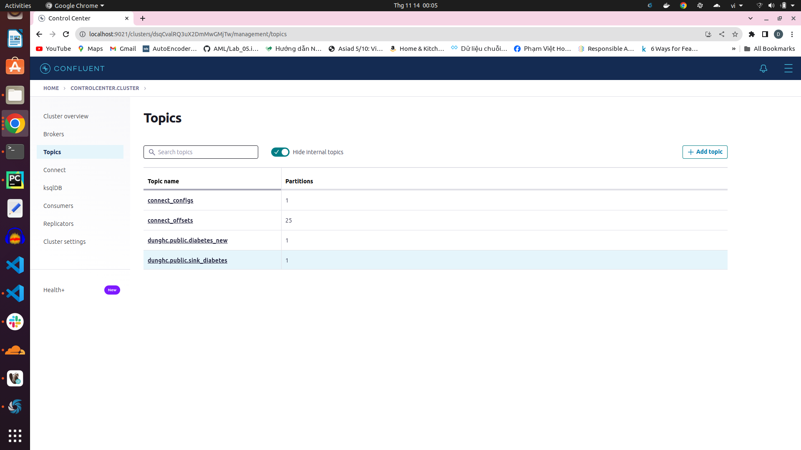
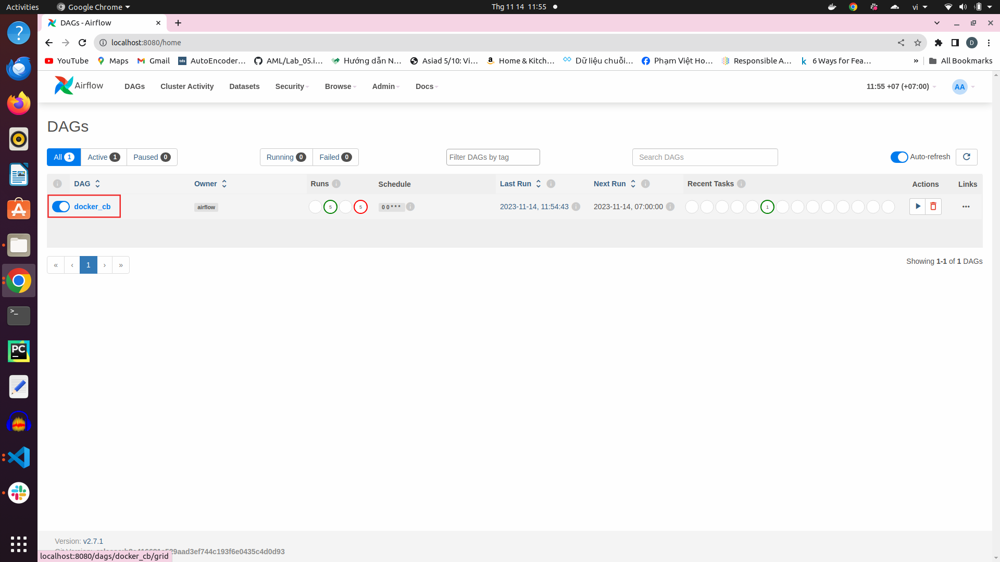
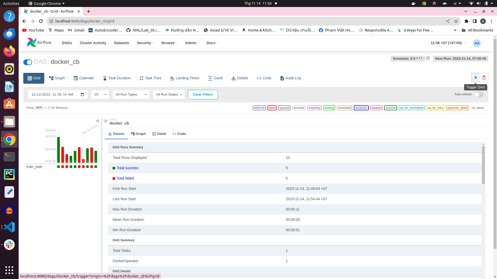

# Feature Store

## Overall data pipeline architecture:


## Note:
+ **ansible** folder: 
    + **deploy_dataflow**: use for deploying data pipeline on google cloud compute
+ **batch_processing** folder: contain pyspark scripts to process batch data
+ **stream_processing** folder: contain pyflink scripts to process streaming data
+ **config** folder: PostgreSQL config sent to Debezium
+ **data_validation** folder: use Great Expection to validate data
+ **deltalake** folder: content scripts to write csv files into deltalake format used for build lakehouse
+ **GCP** folder: necessary scripts and dependencies jar files when deploying data pipeline on google cloud compute
+ **GKE** folder: deploy minio service using k8s
+ **jar-files** folder: 
+ **models** folder: dependencies jar files needed to run flink and spark
+ **PostgreSQL_utils** folder: contain funtions to interact with PostgreSQL such as: create table, insert data to PostgreSQL 
+ **run_env_airflow** folder: enviroment to run airflow service
+ **utils** folder: helper funtions

## 1. Installation
+ Tested on Python 3.9.12 (recommended to use a virtual environment such as Conda)
+ Install requirements: ```pip install -r requirement.txt```
+ Data: diabetes data collected from different sources on the internet
+ Docker engine

## 2. Data pipeline on prem
### How to guide
+ ```docker compose -f docker-compose.yml -f airflow-docker-compose.yaml up -d``` to start all needed services:


### 2.1. MinIO
+ MinIO is a datalake service
+ We can access MinIO console at port 9001

#### 2.1.1. Manual interaction
+ First, click to **Buckets**

+ Choose **Create Bucket**

+ Name the bucket and click to **Object Browser**

+ Choose bucket had created on the console

+ Click **Upload** to upload any files or folders

#### 2.1.2. Automate interaction
+ Beside manual upload, we can use code to upload files or folder to MinIO
#### How to guide
+ ```cd utils```
+ ```python export_data_to_datalake.py```
+ All files needed to upload to MinIO will be executed 


### 2.2 Deltalake
+ To improve queries's performance, csv files data are converted to deltalake format, which will organize metadata for us and turn MinIO from datalake storage to lakehouse storage
#### How to guide
+ ```cd deltalake```
+ ```python write_deltalake_format.py```
+ Csv files early will be converted to parquet files and log file added

+ In _delta_log file, we can check changes on the parquet file

    + In this example, we have added 768 samples to the parquet file
### 2.3 Batch processing
+ Pyspark comes into plays when raw diabetes csv files needed to be preprocessed before feeding to models
+ Notice that some columns of dataset such as: Pregnancies, BloodPressure, SkinThickness, Insulin, Age have wide value ranges. Therefore, these columns needed to be scaled into 0 and 1, so min-max scaler is chosen 
#### How to guide
+ ```cd batch_processing```
+ ```python pyspark_processing.py``` 
+ Processed data will be stored in PostgreSQL datawarehouse for later used

### 2.4 Data validation
+ Before training new models, data in datawarehouse needed to be validated to ensure that data in a gold zone
+ To validate data, great expectation will run this task
+ In data_validation, there are 2 notebook files:
    + **full_flow.ipynb**: Create an expectation suite to validate all numerical fields of the dataset will not be null

    + In this example, all validate cases are success. Data is ready to be served
    + **reload_and validate.ipynb**: Reuse the expectation suite to validate new data

### 2.5. Streaming data source
+ Besides csv files data, there is also a streaming diabetes data
+ A new sample will be stored in a table in PostgreSQL
+ Then Debezium, which is a connector for PostgreSQL, will scan the table to check whenever the database has new data
+ The detected new sample will be push to the defined topic in Kafka
+ Any consumer can get messages from topic for any purposes
#### How to guide
+ ```cd postgresql_utils```
+ ```./run.sh register_connector ../configs/postgresql-cdc.json``` to send PostgreSQL config to Debezium

+ ```python create_table.py``` to create a new table on PostgreSQL
+ ```python insert_table.py``` to insert data to the table
+ We can access Kafka at port 9021 to check the results

+ Then click **Topics** bar to get all existing topics on Kafka

    + **dunghc.public.diabetes_new** is my created topic
+ Choose **Messages** to observe streaming messages


### 2.6. Streaming processing
+ To handle this streaming datasource, Pyflink is a good option to do this task
#### How to guide
+ ```cd stream_processing```
+ ```python datastream_api.py```
    + This script will check necessary key in messages as well as filter redundant keys and merge data for later use

        + Only information columns are kept
    + Processed samples will be stored back to Kafka in the defined sink

        + **dunghc.public.sink_diabetes** is the defined sink in my case
+ ```python kafka_consumer.py```
    + Messages from sink will be fed into diabetes service to get predictions
    + From then, New data is created
    + Notice, we have to validate predictions from the diabetes model to ensure labels are correct before using that data to train new models.
### 2.7. Airflow
+ Airflow is a service to manage a pipeline
+ In this repo, airflow is used to running training script on every first day of month
#### How to guide
+ Airflow is accessed at port 8080

    + We can login to Airflow console with **Username** and **Password** are airflow
+ Click to **docker_cb DAG** to see details

+ To run script immediately, click to **Trigger DAG**

+ Logs of training script will be displayed on **Logs Bar**

+ New training models will be saved at path ```run_env/models```

### The entire data system on local is deployed at this time

## 3. Deploy data pipeline on Google Compute Engine
### How to guide

+ ```cd ansible/deploy_dataflow```
+ To initialize a compute engine, json key file of service account on google cloud is located at **secrets folder**
+ ```ansible-playbook create_compute_instance.yaml``` to create virtual machine instance using ansible. Configuration of machine was defined in file create_compute_instance.yaml

    + Virtual machine is ready to run
    + Before moving to next step, subtitute **External IP** of created compute engine to **inventory file** in **ansible folder**
 
+ ```ansible-playbook -i ../inventory deploy.yml``` to deploy data pipeline on cloud. It takes approximately 10 minutes to copy all depencies files and run all used services.

+ Services are accessed at **External IP:Port**

## Note: **Used ports needed to open firewall on Google Cloud**

## 4. Deploy MinIO on Google Kubernetes Engine

+ Besides, Google Kubernetes Engine is also an optimal service to deploy
+ After deploying MinIO, we can use that service similar to Google Cloud Storage
### How to guide

+ Go to [Google Kubernetes Engine](https://console.cloud.google.com/kubernetes/list/overview?project=asr-callcenter)
+ Click **CREATE** to config cluster

+ Choose **SWITCH TO STANDARD CLUSTER** to change mode of the cluster

+ To saving moneys, go to **default-pool**, fill **1** in **Size** to set number of nodes in cluster is 1

+ Go to **Nodes**, choose kind of machine want to use in **Machine type**, each kind of machine has different price. In my case, i choose **e2-standard-16(16 vCPU, 8 core, 64 GB memory)** and set up storage up to 120 GB in **Boot disk size (GB)**. 

+ Click **CREATE** to creat configured cluster

    + It takes about 10 minutes to start cluster
+ When cluster is on, click **Actions** 

+ After that, choose **Connect** to get command line to connect to the cluster

+ ```kubectx``` and choose **gke_asr-callcenter_us-central1-c_cluster-1** to switch to GKE cluster
+ ```cd GKE/minio```
+ ```helm install --namespace minio-operator --create-namespace minio-operator operator-5.0.10.tgz --values operator/custom-operator-values.yaml``` to install MinIO Operator Console  
+ ```kubens minio-operator``` to switch from **default** namespace to **minio-operator** namespace
+ ```k apply -f service.yaml``` 
+ ```k get all``` to get all objects in the namespace

+ MinIO Operator can be accessed at port 30000 of node that created on cloud has external IP is 104.197.32.159

+ ```SA_TOKEN=$(kubectl -n minio-operator  get secret console-sa-secret -o jsonpath="{.data.token}" | base64 --decode)```
+ ```echo $SA_TOKEN```

+ Copy key and paste to **Enter JWT** placeholder to login into MinIO Operator

+ Next step, set up a Tenant by typing ```helm install --namespace tenant-ns --create-namespace tenant-ns tenant-5.0.10.tgz --values tenant/tenant-custom-values.yaml```
+ ```kubens tenant-ns```
+ ```k apply -f tenant1-service.yaml```
+ ```k get all```

+ MinIO Tenant can be accessed at port 31353 of node that created on cloud has external IP is 104.197.32.159

    + We can login to MinIO Tenant Console with **Username** is minio and **Password** is minio123
+ We can interact with MinIO Tenant similar to part **2.1** above

+ We can also check used storage and avaible storage of the Tenant on MinIO Operator Console

#### Here is the end of this repo. If you feel it useful, don't forget to give me 1 star. It will be huge encouragement for me.